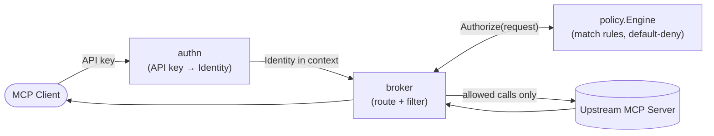
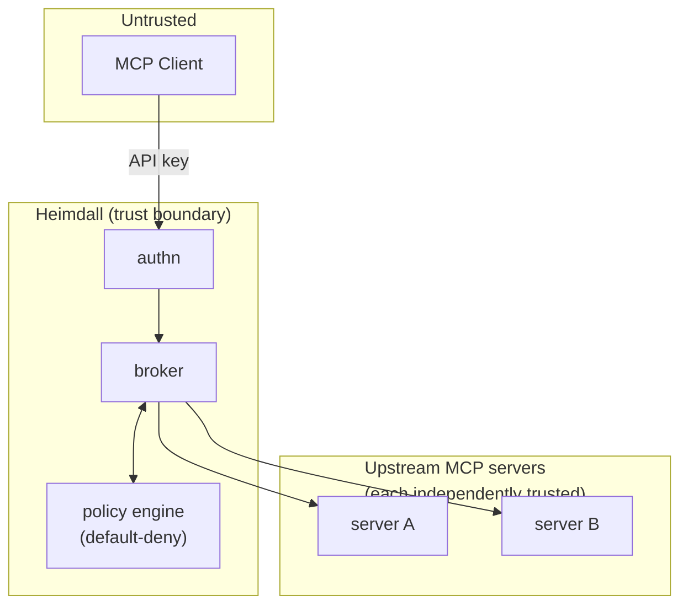

# Heimdall

Identity-aware authorization gateway for MCP servers.

## The problem

MCP servers expose tools to whatever client connects to them, with no concept of *who* is calling or *what they should be allowed to do*. Point two different clients — a trusted internal script and an untrusted third-party agent — at the same upstream MCP server, and both see the same tools with the same permissions. There is no per-identity authorization boundary. Heimdall sits in front of one or more upstream MCP servers and enforces one: every request is authenticated, matched against policy, and either allowed or denied before it reaches an upstream tool. Without it, "which agents can call which tools" is a question your upstream servers can't answer.

## Architecture

Every request passes through the same four stages, in order, regardless of which tool or upstream it targets:



Authentication resolves *who* is calling (`Identity{User, Client, Groups}`). Authorization decides *what* they can do, at both `tools/list` (filtering) and `tools/call` (re-checked independently — filtering is never the security boundary). The broker is the only component that talks to upstream servers; nothing upstream is reachable except through it.

## Trust boundaries



A client is never trusted with more than its policy grants, and one compromised or misbehaving upstream server cannot see traffic or credentials meant for another — the broker is the only thing with visibility across both sides.

## Quick start

```bash
go build -o bin/heimdall .

# validate the example config before starting anything
./bin/heimdall validate --config examples/basic/heimdall.yaml

# start the gateway
./bin/heimdall serve --config examples/basic/heimdall.yaml
```

In another terminal, call it as the `alice` identity from `examples/basic/heimdall.yaml`:

```bash
curl -X POST http://127.0.0.1:9090/mcp \
  -H "X-API-KEY: my-secret-key-alice" \
  -H "Content-Type: application/json" \
  -H "Accept: application/json, text/event-stream" \
  -d '{"jsonrpc":"2.0","id":1,"method":"initialize","params":{"protocolVersion":"2024-11-05","capabilities":{},"clientInfo":{"name":"curl-demo","version":"1"}}}'
```

Check what policy would decide for a given identity and tool, without a running gateway:

```bash
./bin/heimdall policy check \
  --policy examples/basic/policy.yaml \
  --user alice \
  --action tools/call \
  --resource-kind tool \
  --resource-name everything.list_files
```

## Policy example

`examples/basic/policy.yaml` — default-deny for everyone except the two rules below:

```yaml
rules:
  - id: engineering-allow-all-tools
    effect: allow
    subjects:
      users:
        - alice
    actions:
      - "tools/list"
      - "tools/call"
    resources:
      kinds:
        - tool
      names:
        - "everything.*"

  - id: support-allow-list-files-only
    effect: allow
    subjects:
      users:
        - bob
    actions:
      - "tools/list"
      - "tools/call"
    resources:
      kinds:
        - tool
      names:
        - "everything.list_files"
```

Any request that doesn't match an `allow` rule is denied — there is no implicit allow.

## Two identities, two visible tool sets

`examples/basic/heimdall.yaml` configures two clients against the same upstream: `claude-code` (used by `alice`, engineering) and `cursor` (used by `bob`, support). Client and user are deliberately distinct here — the map key (`claude-code`, `cursor`) identifies *which client credential* is authenticating, `user:` identifies *which person* is behind it. They authenticate against the same gateway and the same upstream server, but policy gives them different tool sets — `alice` can call anything under `everything.*`, `bob` can only call `everything.list_files`. Same request shape, different identity, different outcome:

```bash
./bin/heimdall policy check \
  --policy examples/basic/policy.yaml \
  --user alice --action tools/call --resource-kind tool --resource-name everything.delete_file
# -> ALLOW rule="engineering-allow-all-tools"

./bin/heimdall policy check \
  --policy examples/basic/policy.yaml \
  --user bob --action tools/call --resource-kind tool --resource-name everything.delete_file
# -> DENY (no rule grants bob anything outside everything.list_files)

./bin/heimdall policy check \
  --policy examples/basic/policy.yaml \
  --user bob --action tools/call --resource-kind tool --resource-name everything.list_files
# -> ALLOW rule="support-allow-list-files-only"
```

This is the actual authorization boundary Heimdall exists to enforce: identity determines the tool set, not just whether a request is answered at all. The same distinction holds against the live gateway (`tools/list` returns a filtered set per identity, and `tools/call` re-checks independently of what was listed).

## Security model

- **Authentication**: static API keys, SHA-256 hashed at load time and compared as hashes — plaintext keys are never held in the lookup table. Duplicate keys are rejected at startup, not silently resolved to whichever identity loaded last.
- **Authorization**: default-deny. A request is allowed only if an explicit `allow` rule matches; an explicit `deny` always wins over a matching `allow`.
- **Enforcement point**: tool visibility filtering (`tools/list`) and tool invocation (`tools/call`) are authorized independently. A client cannot bypass filtering by calling a hidden tool directly — the invocation path re-checks policy itself.

## Limitations / non-goals (today)

- Single-instance only — no distributed deployment, no shared rate-limit or session state across replicas.
- Only the `http` upstream transport is implemented; `stdio` is explicitly rejected at config validation, not silently ignored.
- No policy hot-reload yet — a policy change requires restarting the gateway.
- No audit log, metrics, or structured request logging yet — authorization decisions aren't currently persisted anywhere beyond the response itself.
- No rate limiting.
- Credentials are static, long-lived API keys — no short-lived token issuance yet.

## Status

Actively built in public tiers, roughly: correctness and test hardening → this document → a CLI-driven permission-testing workflow (`heimdall check`/`explain`/`access-matrix`) → observability and audit logging → credential hardening. This README will grow with each tier rather than describe work that hasn't landed yet — if a command or feature isn't documented above, treat it as not real yet.

## License

MIT — see [LICENSE](LICENSE).
